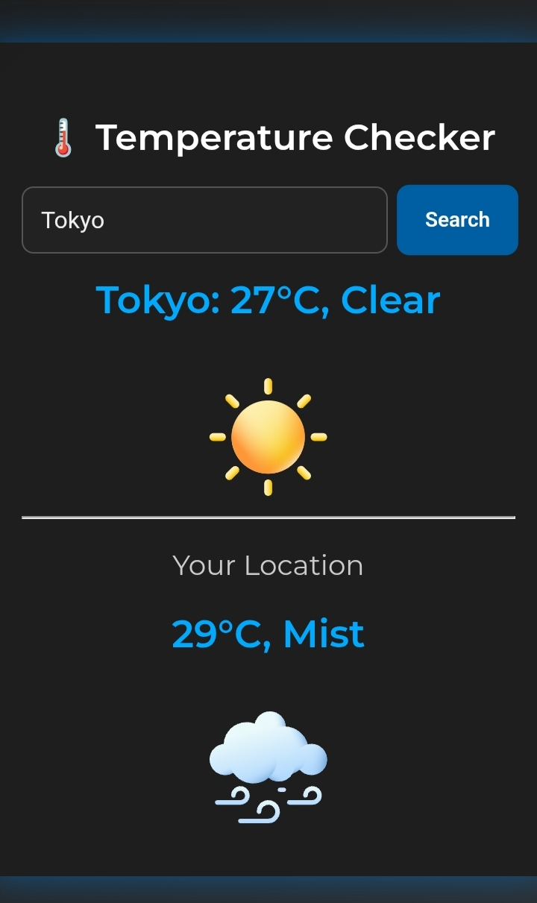

# Weather App 🌡️

A simple and stylish weather app that allows users to:

- Check the temperature and weather condition of any city.
- Automatically fetch the local weather of the user’s location.
- See an appropriate weather icon based on current conditions.

---

## ⭐ Features

- Search for any city and get its temperature and weather description.
- Automatically shows the user’s local temperature on page load.
- Animated loading bars while fetching data.
- Modern, responsive design with a dark theme.
- Graceful error handling for invalid city names or API issues.
- Shows the city name exactly as typed by the user, with proper capitalization.

---

## Demo

---

# 🔴 Live Preview 

https://html-guy0.github.io/Weather-App/

---

# ❓How to use❓

1. Type a city name in the search bar and click Search.

2. The temperature and weather description will appear along with an icon.

3. Your local weather will display automatically below the search section.

---

# 📑 Files

index.html — The main HTML file.

styles.css — All styling for the app.

script.js — JavaScript logic for fetching and displaying weather.

icons/ — Folder containing weather icons used in the app.

---

# 💻 API Used

This app uses the wttr.in API to fetch weather data in JSON format.

# ❌ Glitches

- If you type a random word, it would still show the temperature of it but it wouldn't be a real temperature, it just shows a random temperature.

# Credits

- Icons are taken from **CodingNepal** (Youtube) except haze.svg, overcast.png and shower-in-vicinity.png

- Inspiration is also taken from **CodingNepal** (Youtube).
